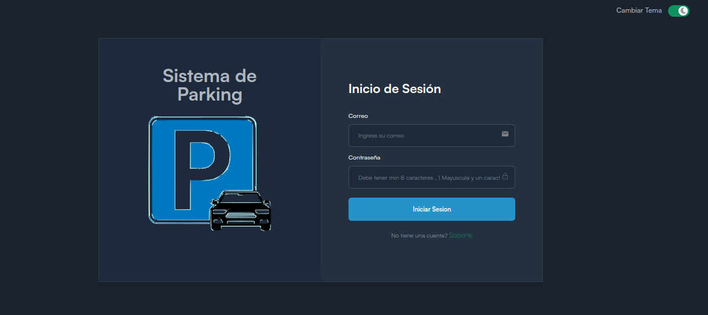

# Parking protect React Java V2

Proyecto creado para implementar un modelo de negocio de un sistema para gestionar el parking de automoviles y motocicletas de estacionamiento.

Esta nueva version del proyecto diferencia en cambios de la manipulacion de datos desde el back , en esta nueva version se devolvera desde el back todos los parkings Paginados y ordenados tanto si se buscan por licencia o estado del parking. 😀

## Tecnoclogias usadas

- Backend: java
- FrontEnd: React

## Estructura del Proyecto

1. Frontend (React)

   - Pages:

     - Home: Dashboard con información general del estacionamiento, con enlaces a las diferentes  
        secciones.
     - Listado de Parkings : pagina para listar todos los parkings.
     - Admin: Página para gestionar tarifas , creacion de nuevo empleado , reportes , administracion extra de parking.
     - Ingreso de Parking: Página para gestionar las entradas de vehículos.
     - Salida de Parking: Página para gestionar las salidas de vehículos.
     - Configuracion: Página para gestionar la cuenta y visualizar perfil.
     - Acerca: Página para mostrar informacion del software.
     - Reportes: Página para visualizar reportes (e.g., ingresos, ocupación del
       estacionamiento).
     - Contratos: Página para visualizar contratos de usuarios abonados (se vera su inplementacion).

2. Backend (Spring Boot)

   - Entities:

     - Members: Representa a los propietarios de los vehículos.
     - Employee: Representa a los empleoados del sistema.
     - Vehicle: Representa los vehículos estacionados.
     - Rate: Representa los tarifas por tipo de vehiculo.
     - Parking: Registra las transacciones del estacionamiento,
       incluyendo tiempo de entrada, tiempo de salida, tarifa calculada, etc.

   - Repositories:

     - EmployeeRepository: Para realizar operaciones CRUD sobre los Employee.
     - VehicleRepository: Para realizar operaciones CRUD sobre los vehículos.
     - ParkingRepository: Para registrar y gestionar las transacciones del
       estacionamiento.

     - RateRepository: Para realizar operaciones CRUD de las tarifas.

   - Services:

     - EmployeeService: Lógica de negocio para la gestión de empleados.
     - VehicleService: Lógica de negocio para la gestión de vehículos.
     - ParkingService: Lógica de negocio para manejar las transacciones.
     - RateService: Lógica de negocio para manejar las transacciones.

   - Controllers:

     - EmployeeController: Endpoints para la gestión de usuarios.
     - VehicleController: Endpoints para la gestión de vehículos.

   - ParkingController: Endpoints para gestionar las transacciones de  
     estacionamiento.
   - RateController: ndpoints para la gestión de tarifas.

   - Security:
   - Implementa Spring Security para manejar la autenticación y autorización, protegiendo
     así las rutas según los roles de usuario (e.g., admin, user) y en el front con NextAuth.

- Reportes y Estadísticas:

  Implementa reportes que muestren las estadísticas de ocupación y los ingresos del estacionamiento. Puedes hacer esto mediante consultas SQL personalizadas o utilizando las capacidades de JPA.(no se si se implementara)

## Reportes de google

# Security

- NextAuth:Front
- SpringSecurity: back (aun no determinado) minimo JWT🙃.
